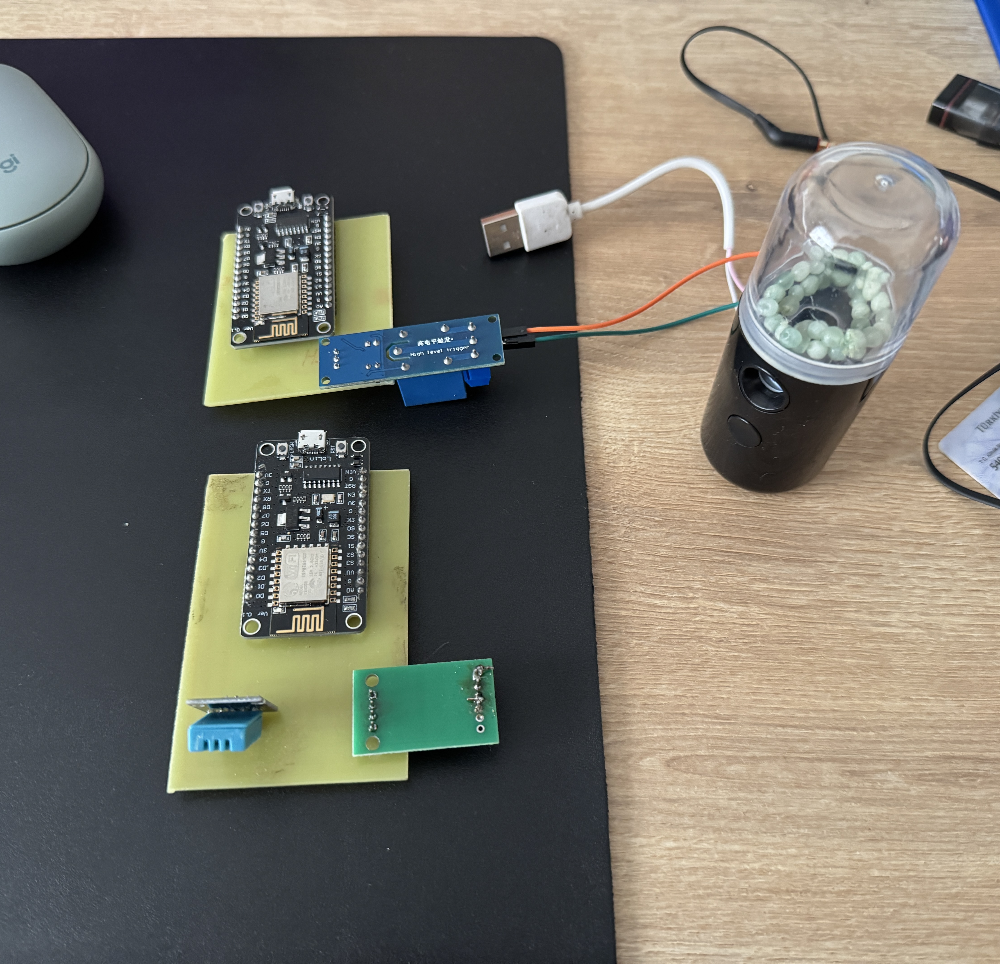

# home-automation-sleep-quality

# 🌿 Smart Humidity Controller

This project is designed to **increase sleep quality** at night by **automatically adjusting room humidity** using sensor data and wireless communication.

## 🌟 Project Overview

- When a person goes to bed, the system **automatically activates the humidifier** to bring the humidity to an optimal level for sleep.
- **Wireless communication** between devices is achieved using **ESP-NOW** protocol.
- Uses **NodeMCU ESP8266** microcontrollers for sensor data collection and decision-making.

## 🛠️ **Components Used**
| Component | Description |
|-----------|------------|
| **NodeMCU ESP8266** | Microcontroller for wireless communication |
| **DHT11 Humidity Sensor** | Measures ambient humidity |
| **HX711 Weight Sensor** | Used for detecting presence in bed (Eliminated) |
| **Single Channel 5V Relay** | Controls the humidifier |
| **USB Ultrasonic Humidifier** | Adjusts room humidity |
| **Power Banks** | Provides power for the system |

## 📡 **How It Works?**
1. **Master ESP8266** reads data from **DHT11 humidity sensor**.
2. Data is transmitted to **Slave ESP8266** via **ESP-NOW**.
3. If humidity is **below 60%**, the **humidifier is turned on** via relay.
4. Once the humidity reaches the required level, the **humidifier is turned off**.

## 🔗 **ESP-NOW Wireless Communication**
- **ESP-NOW** is a low-power communication protocol similar to **2.4GHz wireless devices**.
- It allows **peer-to-peer and multi-device** communication without requiring Wi-Fi.
- After pairing, **secure data transfer** happens without extra handshaking.

## 📊 **Board Pinouts-PCB Schematic**

## 📊 **Picture of the Prototype**
Below is an image of the actual **hardware prototype**:

## 📊 **System Diagram**
Below is the **system architecture** and **working principle**:

### **1️⃣ System Block Diagram**

### **2️⃣ Code Flow Diagram**

## 🛠️ **Installation & Usage**
1. Upload **`master.ino`** to the **first ESP8266**.
2. Upload **`slave.ino`** to the **second ESP8266**.
3. Power the system using **USB power banks** or **DC adapter**.
4. **Monitor humidity levels** and test the automatic humidifier activation.

## 📜 **Code Explanation**
The project consists of **two main Arduino-ESP8266 Board codes**:
- **`sonmaster.ino`** (Controls the DHT11 sensor & transmits data)
- **`sonslave.ino`** (Receives data & controls the humidifier relay)

## 📌 **Future Improvements**
- 🔧 **Improve humidity control precision** with PID algorithm.
- 📡 **Add MQTT or HTTP integration** for remote monitoring.
- 📊 **Data logging feature** for tracking humidity variations.

## 🎯 **Contributors**
👤 **Ferhat Kangal** – *Biomedical Engineer*  
📧 kangalferhat@hotmail.com  

---

## 🚀 **How to Contribute?**
Feel free to **fork** this repository, submit **issues**, and create **pull requests** for improvements!  
Happy coding! 🚀
